#+options: ':nil *:t -:t ::t <:t H:3 \n:nil ^:t arch:headline
#+options: author:t broken-links:nil c:nil creator:nil
#+options: d:(not "LOGBOOK") date:t e:t email:nil expand-links:t f:t
#+options: inline:t num:t p:nil pri:nil prop:nil stat:t tags:t
#+options: tasks:t tex:t timestamp:t title:t toc:nil todo:t |:t
#+title: Taller de Configuracion de Entorno WSL
#+date: 2026-04-11
#+author: Danilo Unapucha, Michael Sornoza, Martin Arevalo, Matías Palomeque
#+email: danilo.unapucha@epn.edu.ec, martin.arevalo@epn.edu.ec, michael.sornoza@epn.edu.ec, matias.palomeque@epn.edu.ec
#+language: Espanol
#+select_tags: export
#+exclude_tags: noexport
#+creator: Emacs 27.1 (Org mode 9.7.5)
* Actividades
** Configuración de WSL con Ubuntu, LaTeX, Python e Emacs
Danilo Unapucha
1. Verificación de entorno mamba/anaconda
#+caption: Evidencia de la configuración de Mamba Info en WSL
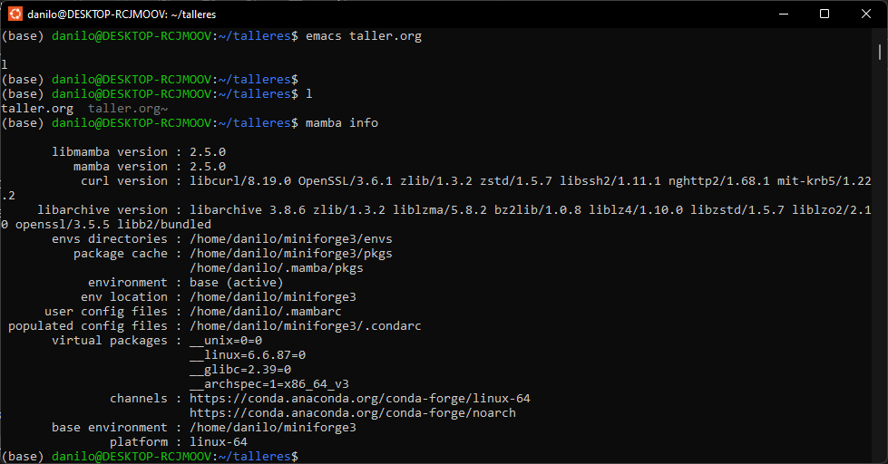

2. Verificación de Python
#+caption: Versión de Python 3
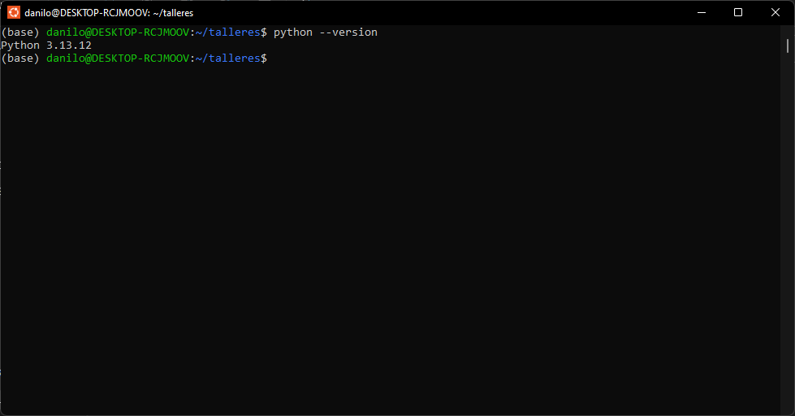

3. Verificación de Emacs
#+caption: Versión de Emacs ejecutándose en modo ventana/terminal
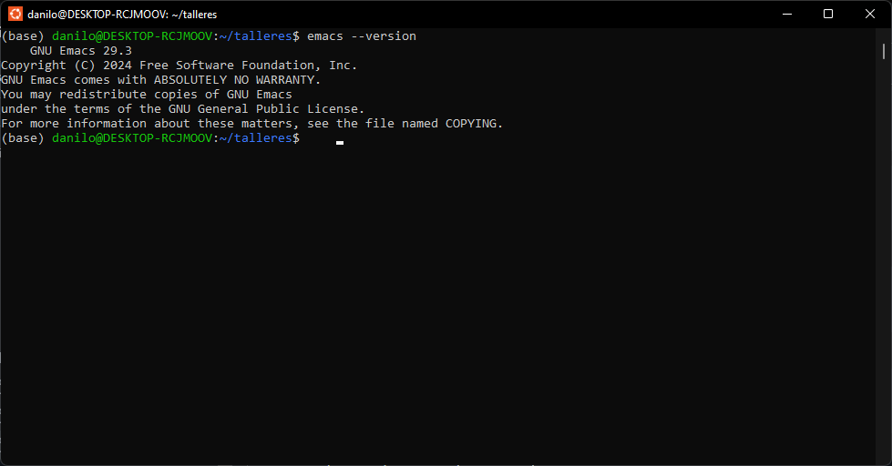

4. Verificación de LaTeX
#+caption: Compilador LaTeX
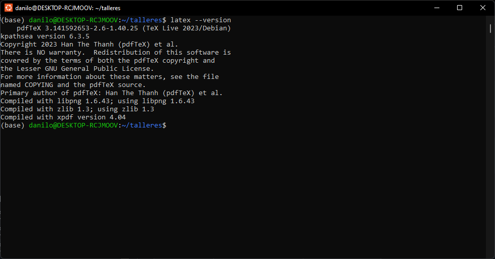

Sebastian Arevalo
1. Verificación de entorno mamba/anaconda
#+caption: Evidencia de la configuración de MambaInfo en WSL
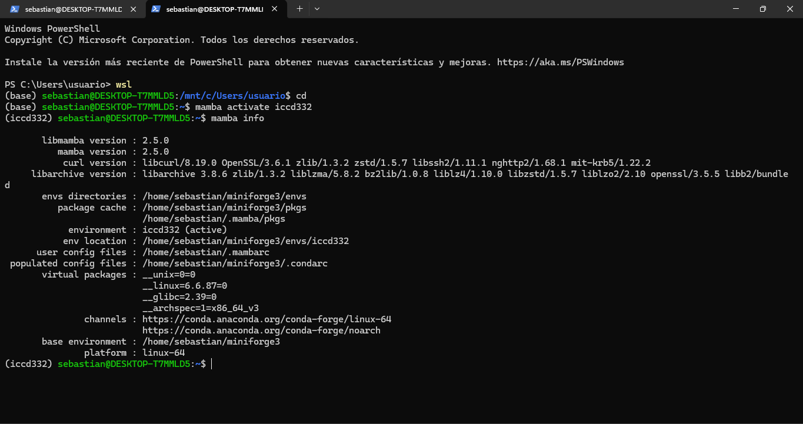

2. Verificación de Python
#+caption: Versión de Python 3
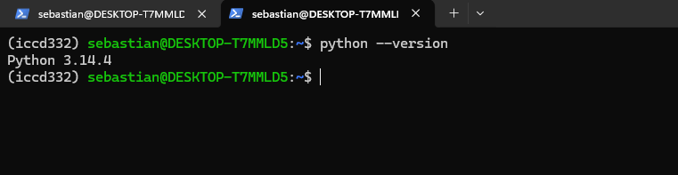

3. Verificación de Emacs
#+caption: Versión de Emacs ejecutándose en modo ventana/terminal
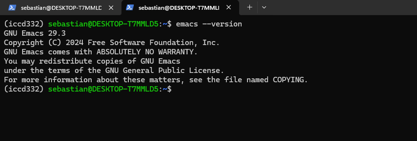

4. Verificación de LaTeX
#+caption: Compilador LaTeX
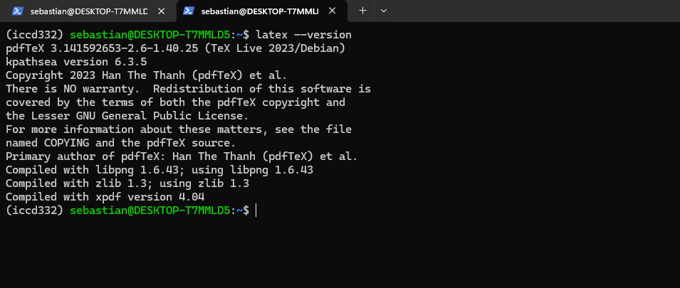

Michael Sornoza
1. Verificación de entorno mamba/anaconda
#+caption: Evidencia de la configuración de MambaInfo en WSL
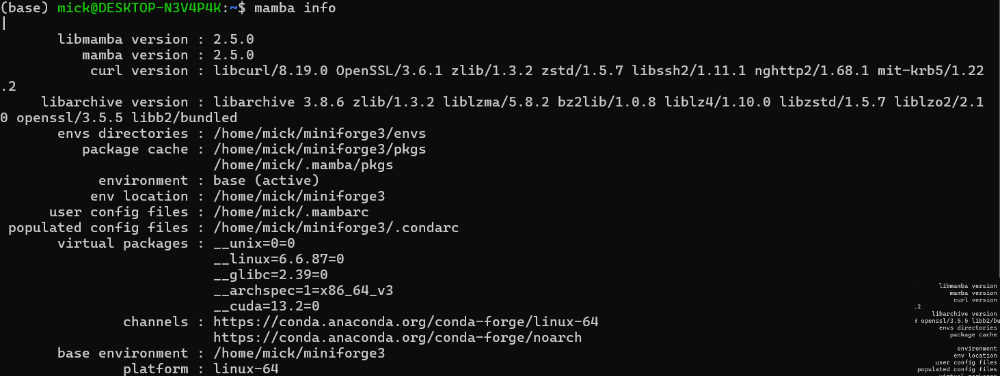

2. Verificación de Python
#+caption: Versión de Python 3
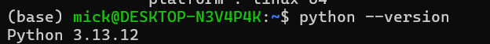

3. Verificación de Emacs
#+caption: Versión de Emacs ejecutándose en modo ventana/terminal
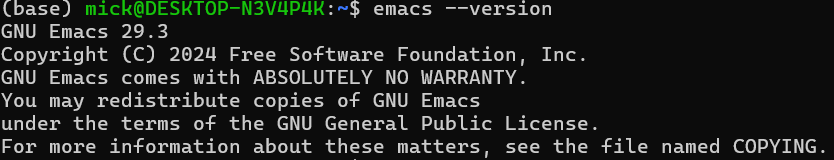

4. Verificación de LaTeX
#+caption: Compilador LaTeX
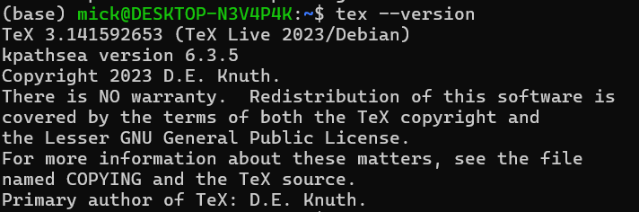

Matías Palomeque
1. Verificación de entorno mamba/anaconda
#+caption: Evidencia de la configuración de MambaInfo en WSL
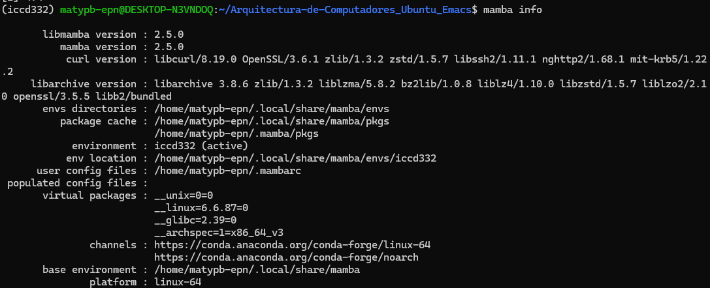
2. Verificación de Python
#+caption: Versión de Python 3
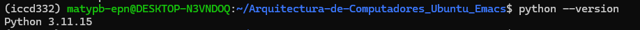
3. Verificación de Emacs
#+caption: Versión de Emacs ejecutándose en modo ventana/terminal
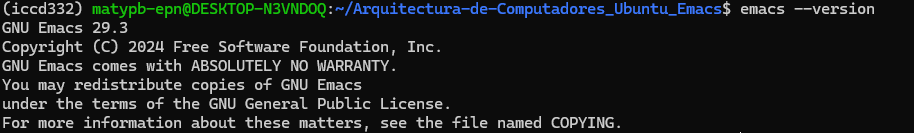
4. Verificación de LaTeX
#+caption: Compilador LaTeX
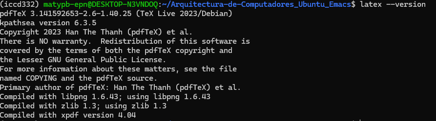
** Comandos emacs tutorial
Danilo Unapucha
| Comando | Descripción                                                                                       | Comando | Descripción                                                                                  |
|---------+---------------------------------------------------------------------------------------------------+---------+----------------------------------------------------------------------------------------------|
| C-l     | Me ayuda a ver de mejor manera el texto ya que me lo pone arriba o en la mitad o abajo            | C-k     | Ayuda mucho al poder eliminar toda la linea en la que me encuentro                              |
| M-k     | Este elimina toda una oración y ayuda bastante al eliminar todo un párrafo si no se esta conforme | C-g     | Este es el mas importante ya que cierra el minibuffer o el comando para sacarnos de un apuro |

Sebastian Arevalo
| Comando | Descripción                                                                                    | Comando | Descripción                                              |
|---------+------------------------------------------------------------------------------------------------+---------+----------------------------------------------------------|
| C-d     | Sirve para suprimir un carácter en el que estoy trabajando muy útil en refacción.              | M-w     | Permite tener la función de copiar texto seleccionado    |
| C-a     | Es bastante útil a la hora de programar de manera en la que no debes buscar el inicio de linea | C-y     | Ayuda muchísimo al dar la función de pegar texto copiado |

Michael Sornoza

| Comando   | Descripción                  | Comando | Descripción                                                   |
|-----------+------------------------------+---------+---------------------------------------------------------------|
| C-<SPACE> | Me ayuda a seleccionar texto | M-<     | Te regresa al principio del documento es como la tecla inicio |
| C-x C-f   | Permite abrir un archivo     | C-x b   | Cambiar entre buffers                                         |

Matias Palomeque
| Comando | Descripción                                                   | Comando | Descripción                                                   |
|---------+---------------------------------------------------------------+---------+---------------------------------------------------------------|
| C-n     | Avanza una línea. Permite buscar información de manera rápida | C-v     | Avanza una página. Permite leer un texto de manera más rápida |
| M-e     | Mueve al cursor al inicio de la siguiente oración             | C-u     | Permite darle un parámetro numérico a ciertos comandos.       |

** Comandos Emacs Juego
Danilo Unapucha
| Iteración | Puntaje |
|-----------+---------|
|         1 |     140 |
|         2 |     140 |
|         3 |     140 |
1. Iteración 1
   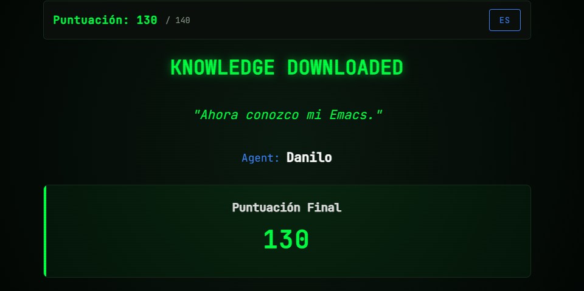
2. Iteración 2
   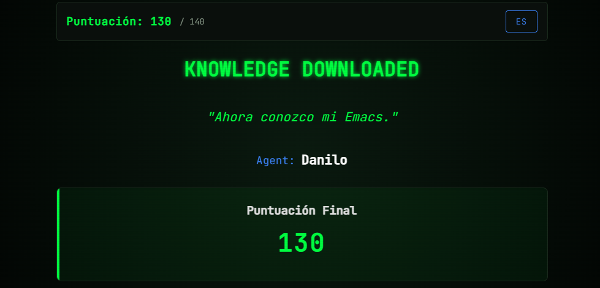
3. Iteración 3
   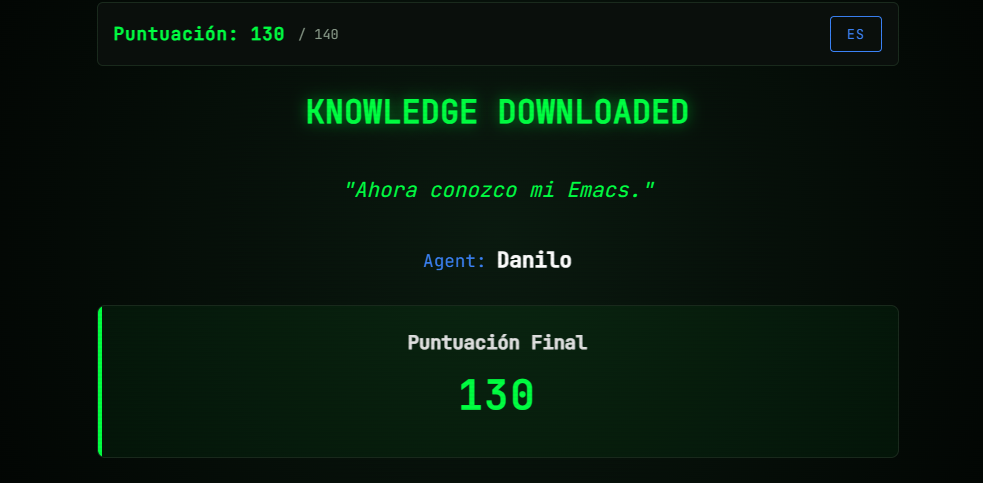

Sebastian Arevalo
| Iteración | Puntaje |
|-----------+---------|
|         1 |     130 |
|         2 |     130 |
|         3 |     125 |
1. Iteración 1
   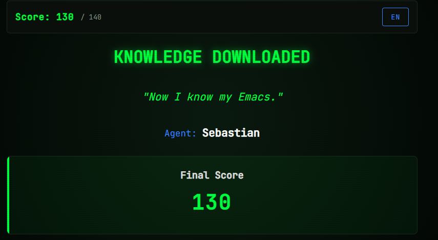
2. Iteración 2
   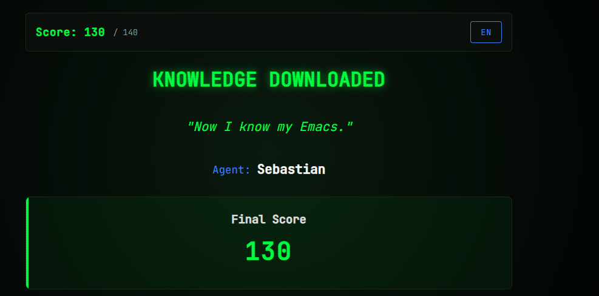
3. Iteración 3
   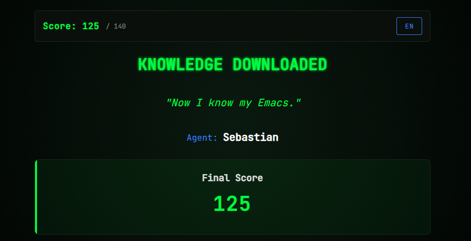
        

Michael Sornoza
| Iteración | Puntaje |
|-----------+---------|
|         1 |     122 |
|         2 |     140 |
|         3 |     140 |

1. Iteración 1
   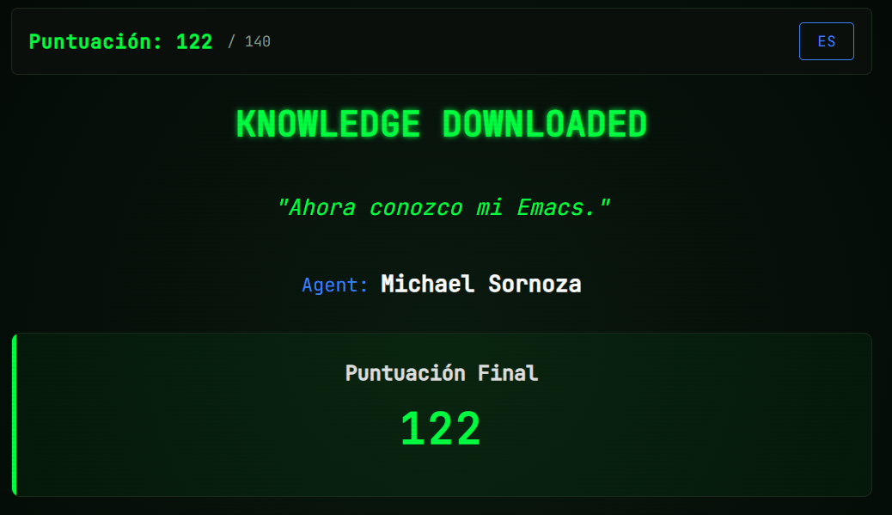
2. Iteración 2
   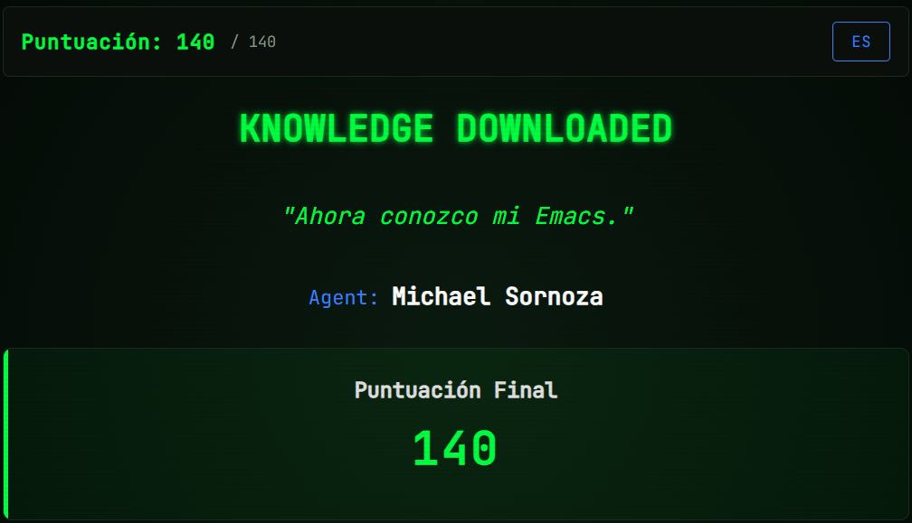
3. Iteración
   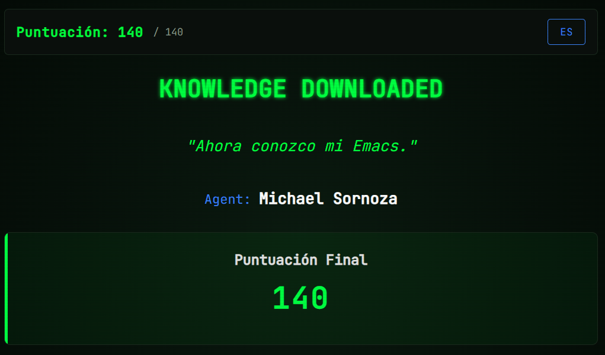
   
Matías Palomeque
| Iteración | Puntaje |
|-----------+---------|
|         1 |     128 |
|         2 |     128 |
|         3 |     140 |

1. Iteración 1
   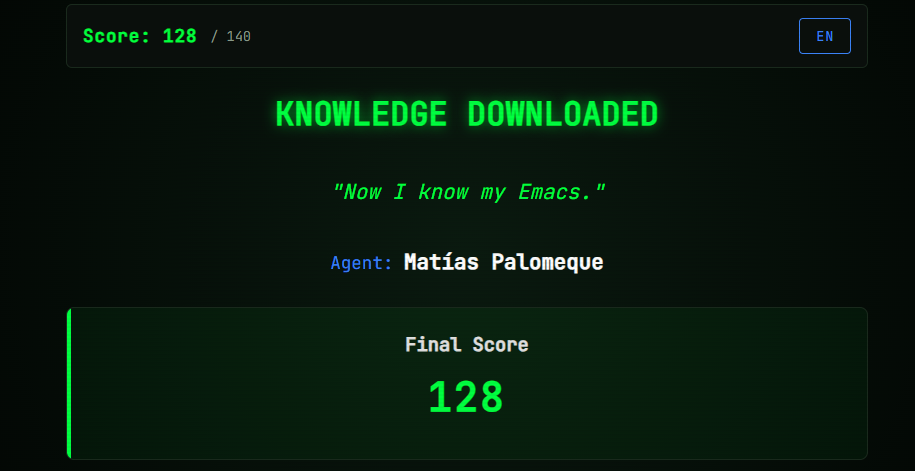
2. Iteración 2
   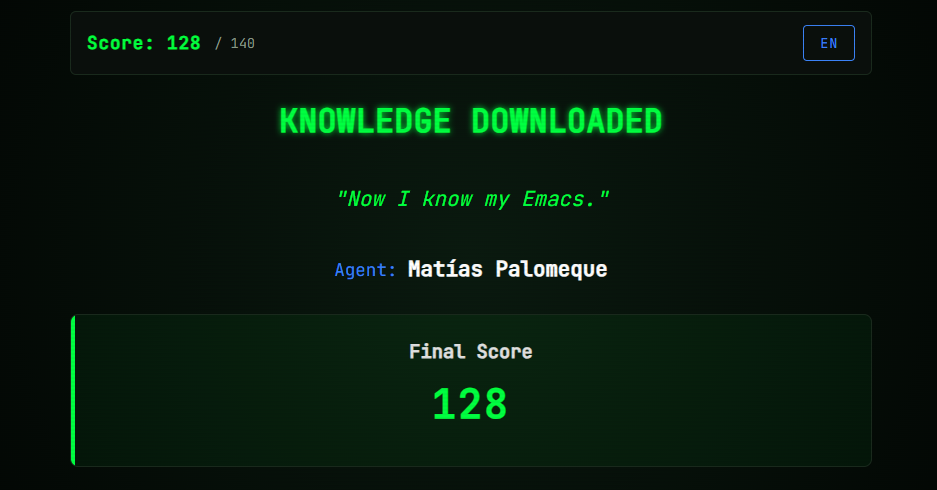
3. Iteración 3
   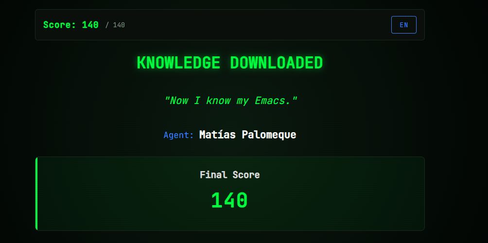
   
   
** Usando Emacs para tener Ayuda sobre Emacs
**Comandos Fáciles**
1. **Danilo Unapucha** C-n. Move cursor vertically down ARG lines.
2. **Sebastian Arevalo** C-x C-s Save currend buffer
3. **Michael Sornoza** C-a. Runs the command org-beginning-of-line (found in org-mode-map).
4. **Matias Palomeque** M-f. Move point forward ARG words (backward if ARG is negative).

**Comandos Dificiles**
1. **Danilo Unapucha** C-v. Scroll text of selected window upward ARG lines; or near full screen if no ARG.
2. **Sebastian Arevalo** C-k kill or remove de line where the cursor is at.
3. **Michael Sornoza** C-u Runs the command universal-argument (found in global-map), which is an interactive native-compiled Lisp function in ‘simple.el’.
4. **Matias Palomeque** C-/. Undo some previous changes.
** Equipo de Trabajo
| Nombre            | email                       | Rol         |
|-------------------+-----------------------------+-------------|
| Danilo Unapucha   | danilo.unapucha@epn.edu.ec  | Lider       |
|                   |                             |             |
|                   |                             |             |
| Matías Palomeque  | matias.palomeque@epn.edu.ec | Colaborador |
|                   |                             |             |
|                   |                             |             |
| Sebastian Arevalo | martin.arevalo@epn.edu.ec   | Colaborador |
|                   |                             |             |
|                   |                             |             |
| Michael Sornoza   | michael.sornoza@epn.edu.ec  | Colaborador |

** Verificación de Entregables
- [X] Verificación de configuración de entorno WSL y paquetes del curso.
- [X] Tutorial de Comandos Emacs realizado.
- [X] Captura de Imágenes y puntajes de Emacs Trainer App.
- [X] Usando Emacs para tener ayuda sobre Emacs
- [X] Verifique que estén los nombres de los integrantes del equipo e identificado el líder.
- [X] Revisión de ortografía con ispell en el buffer
- [X] Generación de Archivo PDF M-x org-latex-export-to-pdf
 
